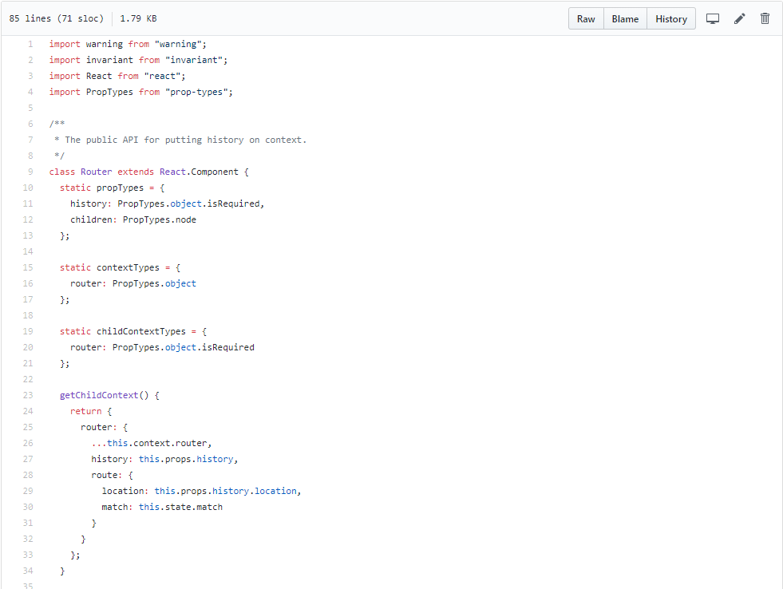

路由跳转的几种方式
- 静态跳转，使用Link、NavLink组件
- 动态跳转，使用history对象跳转

<!--more-->

第一种这里不做介绍，主要介绍第二种。
## 问题

先看一段代码

```js
const BasicExample = () => (
  <Router>
    <div>
      <ul>
        <li><Link to="/">首页</Link></li>
        <li><Link to="/about">关于</Link></li>
        <li><Link to="/topics">主题列表</Link></li>
      </ul>
      <Route exact path="/" component={Home}/>
      <Route path="/about" component={About}/>
      <Route path="/topics" component={Topics}/>
    </div>
  </Router>
)
```
这段代码中history会作为<code>props</code>传入<code>Home</code>组件，但不会传入到<code>Home</code>的子组件中，我们可以一级一级的将<code>history</code>传递下去， 但当层级嵌套很深时怎么办？

## 解决办法

### 1.使用withRouter
使用withRouter是官方推荐的做法，它是一个高阶组件，输入一个组件返回一个组件，<code>history</code>将作为<code>props</code>传递给组件。
> 提示： 使用withRouter的组件必须是<code></code>Router组件的儿子或孙子或......否则报错。
```js
@withRouter
class App extends Component {
  render() {
    return (
      <ul>
        <li onClick={() => this.props.history.push('/test')}>test</li>
      </ul>
    )
  }
}
```
完美解决了history传递问题，但这种做法仅仅是把history暴露给了组件，当你想在mobx之类的状态库中使用history的时候，怎么办？

### 2.使用context
先去看下react-router源码

从上图源码中可以看出，<code>react-router</code>中已经定义了<code>childContextTypes</code>和<code>getChildContext</code>,所以只需组件添加静态属性<code>contextTypes</code>, 便可轻轻松松拿到<code>history</code>
```js
class Test extends Component {
  static contextTypes = {
    router: PropTypes.object
  }

  render() {
    return (
      <ul>
        <li onClick={() => this.context.router.history.push('/test')}>test</li>
      </ul>
    )
  }
}
```
但是越简单的东西往往...
context是一个实验性API，官方不推荐使用,而且同样没解决方法1提出的问题。

### 3.自己创建history(接管history)
想想我们平时是怎样使用路由的
```js
import React from 'react'
import {
  BrowserRouter as Router,
  Route,
  Link
} from 'react-router-dom'

const BasicExample = () => (
  <Router>
    <div>
      <ul>
        <li><Link to="/">首页</Link></li>
        <li><Link to="/about">关于</Link></li>
        <li><Link to="/topics">主题列表</Link></li>
      </ul>

      <hr/>

      <Route exact path="/" component={Home}/>
      <Route path="/about" component={About}/>
      <Route path="/topics" component={Topics}/>
    </div>
  </Router>
)
```
一般都是使用<code>BrowserRouter</code>和<code>HashRouter</code>组件，查阅源码后发现两个组件都是在<code>Router</code>之上的一个封装，<code>Router</code>接受<code>history</code>作为<code>props</code>，这就为我们接管<code>history</code>创造契机

##### 第一步、创建history
```js
import { createHashHistory } from 'history'

export default createHashHistory()
```
创建并返回<code>history</code>实例

##### 第二步、将创建的history传入Router组件
```js
import { Router } from 'react-router-dom'
class App extends Component {
  render () {
    return (
      <Router history={history}>
        ...
      </Router>
    )
  }
}
```
这里千万别使用<code>BrowserRouter</code>和<code>HashRouter</code>

##### 第三步、do whatever you want
<code>history</code>已经暴露出来了，无论是在组件中还是在mobx之类的状态管理中，只用引用下即可获取<code>history</code>实例
```js
import history from 'path-to'

history.push('/hello')
```