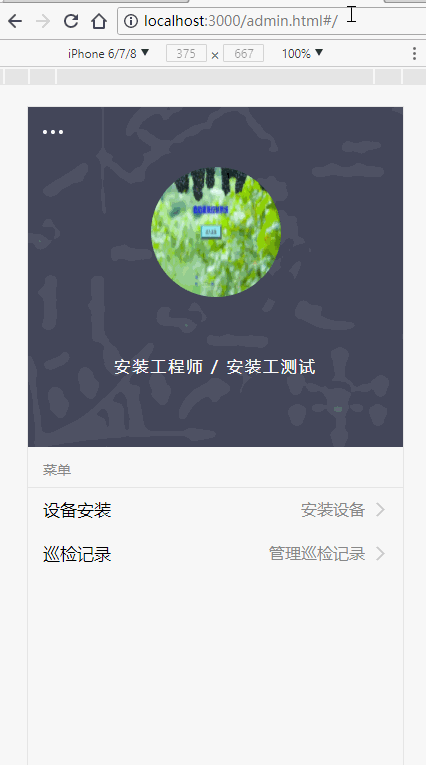

> 最近在做公司一后台管理项目，需要根据用户身份控制其权限，之前的做法仅仅是根据身份把相应的入口给去掉了，路由没做任何处理，直接在地址栏输入地址就能访问所有页面。。。所以这次要花点功夫处理下（,ԾㅂԾ,,）。本代码参(chao)考(xi)了[ant-design-pro](https://github.com/ant-design/ant-design-pro/tree/master/src/components/Authorized)
<!--more-->
## 预览


## 分析

- 登陆成功后，需要设置下权限，进入要主页后还要去读取权限，所以要写个函数去设置/读取权限

<code>./common/authority.js</code>
```js
import localStore from './localStore'

export function getAuthority() {
  return localStore.getItem('authority') || 'azg';
}

export function setAuthority(authority) {
  return localStore.setItem('authority', authority);
}
```
- 权限管理说白了就是对路由的拦截，当用户访问了他不该访问的路径，我们要给他调到403页面，所以我们要封装下<code>Route</code>组件，当访问了不该访问的路径直接redirect到403页面
先看下路由表
```js
[
  {
    path: '/install',
    component: Install,
    authority: 'azg'
    routes: [
      {
        path: '/install/:id',
        component: ConfigGood
      }
    ]
  },
  {
    path: '/debug',
    component: Debug,
    authority: ['tsg', 'kf'],
    routes: [
      {
        path: '/debug/:id',
        component: DebugGood,
      }
    ]
  }
]
```
大概轮廓如下<code>AuthorizedRoute.jsx</code>
```js
const AuthorizedRoute = ({
  component: Component,
  authority,
  redirectPath,
  {...rest}
}) => {
  if (authority === currentAuthority) {
    return (
      <Route
      {...rest}
      render={props => <Component {...props} />} />
    )
  } else {
    return (
      <Route {...rest} render={() =>
        <Redirect to={redirectPath} />
      } />
    )
  }
}
```
根据上边的路由表这么写肯定不行，页面可能允许多个角色访问，authority可能是字符串也可能是数组，所以得重新判，都写在一个组建里有点乱，这里把权限判断抽离出来

```js
/**
 * 权限检查
 * @param { String | Array<Sting> } authority 允许访问的权限
 * @param { String } currentAuthority 用户的权限
 * @param {*} target 尝试访问的页面
 * @param {*} Exception 无权访问的页面
 */
const checkPermissions = (authority, currentAuthority, target, Exception) => {
  // 没有输入authority默认查看所有
  if (!authority) {
    return target
  }

  // 如果authority是字符串
  if (typeof authority === 'string') {
    if (authority === currentAuthority) {
      return target
    }
    return Exception
  }

  // 如果authority是数组
  if(Array.isArray(authority)) {
    if (authority.indexOf(currentAuthority) >= 0) {
      return target
    }
    return Exception
  }

  throw new Error('参数authority输入错误')  
}

const check = (authority, target, Exception) => 
  checkPermissions(authority, CURRENT, target, Exception)

```

再抽象个<code>Authorized</code>组件

```js
const Authorized = ({ children, authority, noMatch = null}) => {
  const childrenRender = typeof children === 'undefined' ? null : children
  return check(authority, childrenRender, noMatch)
}

```
再来改改<code>AuthorizedRoute</code>组件

```js
let CURRENT = getAuthority()  // 获取用户权限

const AuthorizedRoute = ({
  component: Component,
  render,
  authority,
  redirectPath,
  ...rest}) => (
  <Authorized
    authority={authority}
    noMatch={
      <Route {...rest} render={() =>
        <Redirect to={redirectPath} />
      } />
    }>
    <Route
      {...rest}
      render={props => (
        Component ? <Component {...props} /> :
          render(props)
      )} />
  </Authorized>
)
```

这里加入<code>render props</code>,当提供了<code>component props</code>就用<code>component</code>渲染，否则使用<code>render</code>渲染。路由表中没有<code>authority</code>字段默认所有人都可以访问

怎么调用
```js
export const RouteWithSubRoutes = (route) => (
  <AuthorizedRoute path={route.path} authority={route.authority} render={props => (
    <route.component {...props} routes={route.routes}/>
  )}/>
)

export const RouterTransition = ({ location, animateClass, routes }) => {
  return (
    <Route render={() => (
      routes.map(route => (
        <RouteWithSubRoutes key={route.path} {...route}/>
      ))
    )} />
  )
}
```

有子路由的再调用<code>RouteWithSubRoutes</code>渲染就行

## 总结
这样就实现了路由权限配置化，在路由表中设置好权限就行
